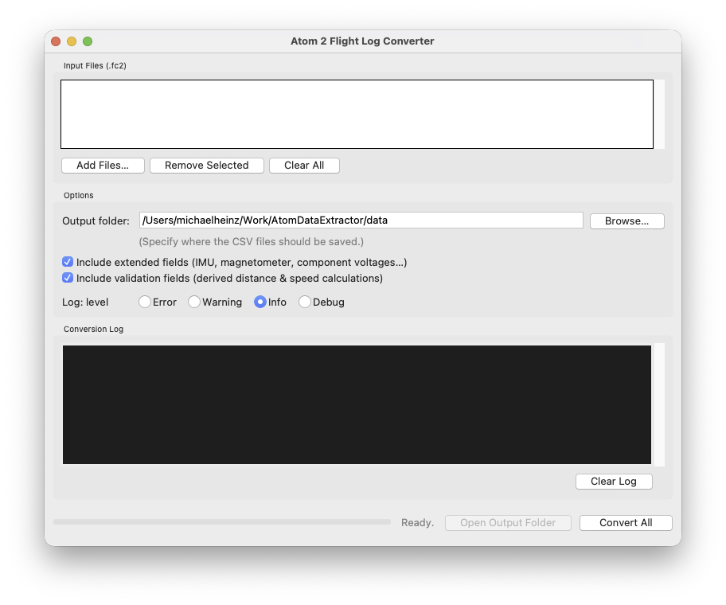
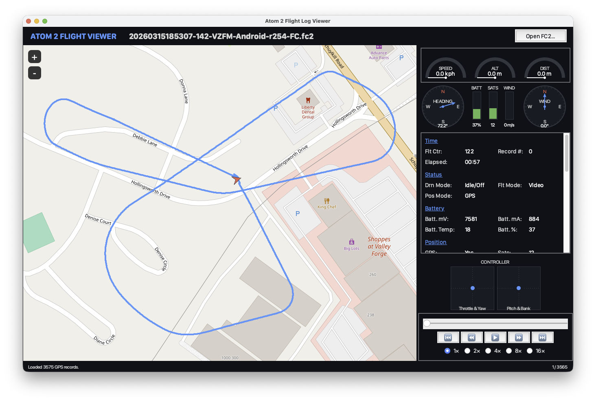
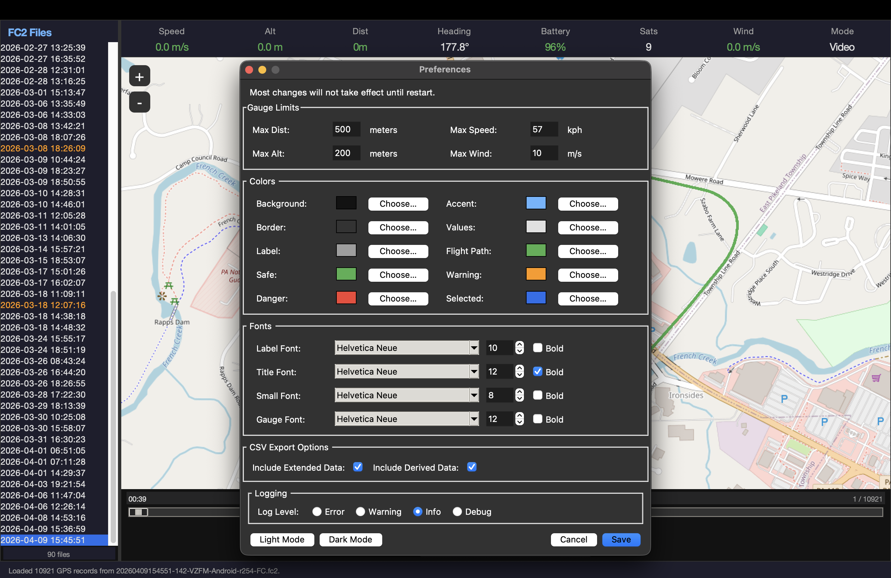
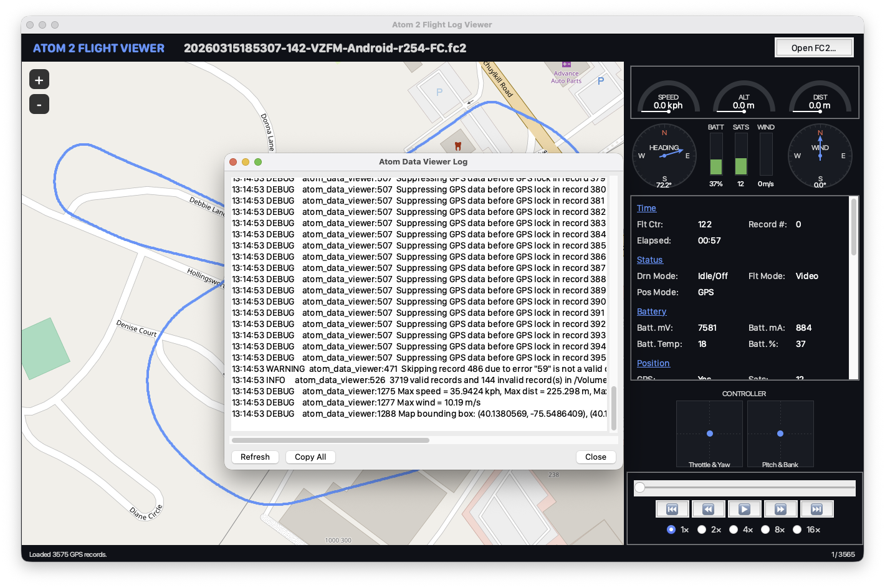

# Introduction
The original purpose of this app is to extract data from the FC2 log files generated by a Potensic Eve application or a Potensic PTD-1 drone controller and to convert them into a CSV file suitable for feeding into the [Telemetry Overlay](https://goprotelemetryextractor.com) application. Which lets me create heads-up displays that can be [overlaid on video generated by a Potensic Atom-2 drone](https://youtu.be/Q-hPca93mgk).

Which, for a nerd like me, counts as fun.

Recently, I got far enough along in reverse-engineering the FC2 file format that it became useful to write an app to play back the files alongside a map widget that shows the movements of the drone. This made it much faster to sanity-check theories about which fields represented what data without having to generate a video first. It's also kind of fun to watch.

# License
This code is open source and distributed under the Apache 2.0 license. (See LICENSE.txt.)

# Whose fault is this, anyway?

You can blame me, [Michael Heinz](https://github.com/mwheinz/AtomDataExtractor), for this. Rob Pritt provided a lot of moral support and suggestions.

## Other Sources and Resources

This app would not exist if Koen Aerts and Rob Pitt hadn't already written the [potdroneflightparser](https://github.com/koen-aerts/potdroneflightparser) - they did a great job but it is not quite what I want for working with Telemetry Overlay; in addition, I've also identified many additional data fields in the ".fc2" log file format, which lets me support some of the more fun gauges in Telemetry Overlay.

# Using AtomDataExtractor

## Requirements
1. At this time, AtomDataExtractor only supports the Atom-2 drone. It could support other Atom models if someone provides me with sample data logs from them or, even better, does the leg work to document another model and submits it as an issue or a pull request.
2. AtomDataExtractor requires python3 and has been tested with Python 3.9.2 and 3.14.3, but it should work with other versions as well. The command line version does not require any other packages. The GUI apps require tkinter, tkintermapview, and pyinstaller. (See below.)
3. You don't need anything else if all you want to do is look at the telemetry data from your drone, but if you want to use these apps to make cool videos, you're going to need [Telemetry Overlay](https://goprotelemetryextractor.com). 

## Building
If you know your way around MacOS Terminal, or Windows Shell, or the Linux terminal app of your choice, and you want to use the CLI version, download the latest release from [github](https://github.com/mwheinz/AtomDataExtractor) and copy atom_data_extractor.py to your personal bin directory. 

To build the GUI apps, start in the main AtomDataExtractor directory:
```
$ python3 -m venv ade-venv
$ source ade-venv/bin/activate
$ pip install tk
```
(on Ubuntu you may need `sudo apt install python3-tk` instead.)
```
$ pip install tkintermapview pyinstaller
$ cd src
$ ./build.sh
```
The final executables will be in the AtomDataExtractor/src/dist directory.

## Getting Telemetry Data From Your Atom 2 Drone
### PTD-1 Controller with SD card
(Note: There seems to be a bug in the PTD-1 firmware, you may need to repeat these steps more than once to get the most recent files.)
1. Put an SD card in the slot on your PTD-1.
2. Turn it on and navigate to Me->Settings.
3. Find the "Transfer to SD card" link and press it.
4. Once the transfer is complete, turn off the PTD-1 and remove the card.
5. Insert the SD Card in your laptop, you will find a directory called FlightLog with subdirectories named by the date of each flight the controller has recorded. Each subdirectory will have at least one file with the ".fc2" extension. Copy those files onto your computer, whereever you wish.

### Copy from the PTD-1 Controller directly or from an Android phone
(Note: On a Mac you will need an Android file transfer utility such as [OpenMTP](https://github.com/ganeshrvel/openmtp) to copy files directly from the PTD-1.)
1. Boot your PTD-1.
2. Using a quality USB cable, connect the PTD-1 to your computer.
3. Navigate to the /Android/data/com.ipotensic.atom/files/FlightLog directory. As above, find the date you are interested in, open that subdirectory and copy the ".fc2" files onto your computer.

## Getting Videos From Your Atom 2 Drone
I highly recommend popping the SD card out of your drone, putting it in your computer and copying it that way. Much faster than using Smart Transfer. If you do use Smart Transfer to copy video and photos from your drone to your tablet or phone, use the same process you use for getting the ".fc2" files off your controller.

## Running Atom Data Extractor
### From the command line
Once you have the data file you want to convert, open your terminal or shell, and run atom_data_extractor.py on it. The easiest way is to just type "atom_data_extractor.py <my fc2 file>". This will generate a CSV file in the same directory as the fc2 file. For example:
```
$» atom_data_extractor.py /home/mwheinz/fc2data/20260219162209-142-VZFM-Android-r254-FC.fc2
Atom 2 Flight Log to CSV Converter.
08:53:52 INFO     csv_extractor:640  Parsing 20260219162209-142-VZFM-Android-r254-FC.fc2
08:53:52 ERROR    csv_extractor:527  Skipping record 7459 due to error Illegal value for Flight Mode (text)
08:53:52 INFO     csv_extractor:562  10372 valid records and 1 invalid record(s) in 20260219162209-null-Android-r254-FC.fc2.
08:53:52 INFO     csv_extractor:568  Report /home/mwheinz/fc2data/20260219162209-142-VZFM-Android-r254-FC.csv complete.
```
Once you have the CSV file, you can look inside with an app like Numbers, Excel, or Google Sheets.

You can also generate additional information if you like, or change the destination of the CSV files, or specify more than one file to convert. Here's the full help text for atom_data_extractor.py:
```
$» atom_data_extractor.py -h
usage: atom_data_extractor.py [-h] [-D DESTINATION] [-l {0,1,2,3}]
                              [-L LOGFILE] [-x] [-v]
                              files [files ...]

Extract telemetry from Potensic Atom 2 flight logs (.fc2)

positional arguments:
  files                 One or more Atom 2 .fc2 files to convert.

options:
  -h, --help            show this help message and exit
  -D, --destination DESTINATION
                        The directory to write the CSV files to. Defaults to
                        the directory the telemetry file is in.
  -l, --log {0,1,2,3}   Set log level. 0=error, 1=warning, 2=info, 3=debug.
  -L, --logfile LOGFILE
                        Redirect logging output to a file.
  -x, --extended        Include extended fields
  -d, --derived         Calcuate some additional fields to compare against the
                        raw data.
  -s, --stats           Report the min and max for all the basic fields.

Written by Michael Heinz. Based on work done by Michael Heinz, Koen Aerts,
and Rob Pitt. See README.md for detailed field documentation.
```

### From the GUI

The GUI is a simple front end that takes all the same options as the command line, but it doesn't currently support automatically writing the CSV files back to the same directory the FC2 files came from. Click on "Add Files" to select the fc2 files you would like to convert and use Output folder to specify where to put the CSV files. Click "Convert All" to start conversion.

### A Note on Error Handling and Data Validation
In the example above, atom_data_extractor.py reported an error in one record. Any record that has data that AtomDataExtractor does not understand will be skipped and ignored - it will not appear in the CSV file. This helps prevent problems with Telemetry Overlay's processing of the data. In addition, GPS coordinates that don't appear valid will be "suppressed" - they will be replaced with empty fields in the CSV file. This will happen if the data appears to be outside the valid range for latitude and longitude or if the drone is reporting GPS coordinates before it says it has a GPS lock. Again, this helps prevent problems when the data is fed to Telemetry Overlay.

## Loading the CSV file into Telemetry Overlay
Fully documenting how Telemetry Overlay works is outside the scope of this document but, in general:
1. Launch Telemetry Overlay.
2. Load the video file you want to work with.
3. When TO tells you it couldn't find any telemetry data, select the telemetry tab and load the CSV file you generated.
4. Select the gauges tab and select the gauges you want to use. To get started, you can find a sample TO pattern file in the AtomDataExtractor/resources directory.
5. IMPORTANT: Because the Atom doesn't provide an exact time code in the video, you will have to manually sync the telemetry data with the video. This can take some practice.
6. Once you have the telemetry data synced up, generate your video!

Note: If you have multiple videos associated with a single CSV file, I recommend processing them separately since the sync offset will be different for each.

## Atom Data Viewer
Atom Data Viewer (adv) is an alternative to loading data into Telemetry Overlay. It is meant to give you a way to review a flight log without dealing with video files. It is built at the same time as ade.py.


### Overview
ADV is a little more complex than ADE. The top of the screen shows the currently loaded FC2 file and, to the right, a button to open new FC2 files. The left is a view of the currently loaded map, while the right shows a read out of most of the telemetry data in the file. At the bottom right are the play back buttons. The slider allows you to jump directly to a point in time, and the play buttons allow you to re-enact the flight at different speeds. In addition, ADV has a file menu with a few options. The Preferences dialog lets you tune the fonts to your machine, change the amount of logging the app generates, and to change the colors of different UI elements to your preference. 


### Logging

Speaking of logging, the File->View Log menu item displays and informational or error messages generated while processing the FC2 file. These aren't usually too useful but they can help you understand what's happening if your file doesn't seem to load correctly. In addition, some basic reporting of the minimum and maximum values of many of the fields will be written to the log if INFO or DEBUG logging is enabled.

# Development notes:

## Participating in this project
I am always looking for contributions! If you are interested, check out the [github project](https://github.com/mwheinz/AtomDataExtractor) and get cracking!

## Telemetry Overlay Documentation:
[Telemetry Overlay Manual](https://goprotelemetryextractor.com/docs/telemetry-overlay-manual.pdf)

## FC2 data file format:
1. Potensic doesn't want people reverse engineering the log file formats for their drones.
2. koen-aerts, who wrote the potdroneflightparser, originally reverse-engineered the file formats for the original Atom, Atom SE and earlier firmware versions of the Atom 2. He doesn't know what to do with the Atom2's FPV files. Says they are "optional".
3. Unfortunately, the FC2 file format appears to have changed since he did his work. Enough fields were still correct to give me a serious leg up. I'm very grateful to him and to Rob for doing it, I probably would have gotten frustrated and given up if they hadn't shown me where to start! 
4. The file name is a reasonably accurate time stamp (unlike the names of the video files). The video files contain no meta data at all, not even time stamps.
5. Each record of an FC2 file is 512 bytes long and begins with a record id. (See below.)
6. Records appear to be packed with little regard to word-alignment.
7. I'm reasonably sure the data in the FC2 file is mostly generated by the PTD-1.
8. The record format is definitely not set in stone. Firmware updates to the PTD-1 may change it.
9. It is possible the record format is different between the PTD-1 and what is generated by the Potensic Eve phone app (used when using the older style controller).

## FC2 Record Format:
Fields are all little-endian.
"Correct" indicates how confident I am in the field definition.

###  Basic Data
| Byte: | Length: | Format: | Description: | Correct: |
|-------|---------|---------|--------------|----------|
| 0 | 4 | integer | Record Id | ✓ |
| 4 | 1 | byte | always zero. ||
| 5 | 8 | long long | micro seconds since the drone started. Can reset in the middle of an fc2 file if the drone is power-cycled but the controller is not. Can be combined with the file name to generate time stamps for each record, which TO can use. | ✓ |
| 17 | 2 | ushort | How many times the drone has flown? Increments with each landing. Slightly more than what the PTD-1 reports. | ✓ |
| 428 | 1 | byte | Drone mode 0 = motors off or idle, 1 = launching, 2 = flying, 3 = landing | ✓ |
| 429 | 1 | byte | During launch >0 means the drone is doing an auto-launch. During flight, 1 = Return-to-Home is active. During flight, 2 = appears to indicated waypoint mode, 6 = an AI mode is active, such as taking a panoramic photo, or orbiting a selected point. | ✓ |
| 430 | 1 | byte | Positioning mode. 3 = GPS, 2 = Optical, 1 = Attitude | ✓ |
| 433 | 1 | byte | Flight mode 7 = video, 8 = normal, 9 = sport | ✓ |
| 456 | 1 | byte | Drone mode 2: 0 = idle or motors off, 1 = launching, 2 = flying, 3 = landing - Sometimes takes longer to enter landing mode than #428 | ✓ |
| 457 | 1 | byte | Positioning mode 2: 3 = GPS, 2 = Optical, 1 = Attitude - Sometimes goes back to opti mode while #430 stays in GPS mode. | ✓ |

###  Inertial Measurement Unit
| Byte: | Length: | Format: | Description: | Correct: |
|-------|---------|---------|--------------|----------|
| 19 | 4 | float | The x-axis accelerometer (m/s2) | ✓ |
| 23 | 4 | float | The y-axis accelerometer (m/s2) | ✓ |
| 27 | 4 | float | The z-axis accelerometer (m/s2) | ✓ |
| 31 | 4 | float | The x-axis reading of the gyroscope. (rads/s) | ✓ |
| 35 | 4 | float | The y-axis reading of the gyroscope. (rads/s) | ✓ |
| 39 | 4 | float | The z-axis reading of the gyroscope. (rads/s) | ✓ |
| 43 | 2 | short | Possibly the reading of the internal barometer. Unknown units. ||

###  GNSS and Positioning
| Byte: | Length: | Format: | Description: | Correct: |
|-------|---------|---------|--------------|----------|
| 45 | 1 | byte | GNSS Lock. Appears to be 0 when there is no GNSS lock and 3 when there is. |✓|
| 46 | 1 | byte | # of GNSS satellites the drone has a lock on. | ✓ |
| 47 | 4 | integer | drone's latitude in ten-millionths of degrees. 0 if unknown. | ✓ |
| 51 | 4 | integer | drone's longitude in ten-millionths of degrees. 0 if unknown. | ✓ |
| 71 | 4 | float | The barometric pressure, in Pascals. | ✓ |
| 75 | 2 | short | GPS HDOP * 100 | 50% |
| 304 | 4 | float | How far east or west the drone is from the home point in meters. | ✓ |
| 308 | 4 | float | How far north or south the drone is from the home point in meters. | ✓ |
| 328 | 4 | float | Altitude above the home point, in meters. Take the absolute value before using... | ✓ |
| 368 | 4 | float | Roll in radians. | ✓ | 
| 372 | 4 | float | Pitch in radians. | ✓ | 
| 376 | 4 | float | Compass heading in radians. (yaw) | ✓ |
| 416 | 4 | float | 2D Distance to home, in meters. | ✓ |
| 420 | 4 | integer | Latitude of the home point in degrees * 1e7. | ✓ |
| 424 | 4 | integer | Longitude of the home point in degrees * 1e7 | ✓ |

###  Velocity
| Byte: | Length: | Format: | Description: | Correct: |
|-------|---------|---------|--------------|----------|
| 312 | 4 | float | Velocity N/S (negative is north) (m/s) | ✓ |
| 316 | 4 | float | Velocity E/W (negative is east) (m/s) | ✓ |
| 332 | 4 | float | Velocity U/D (negative is up) (m/s) | ✓ |
| 392 | 4 | float | Corrolates with speed but is much lower than the calculated 2D or 3D speed from dX, dY, dZ. | 25% | 
| 404 | 4 | float | Estimate of wind speed? | 75% |
| 408 | 4 | float | Wind direction in radians. | ✓ |
| 412 | 4 | float | Related to total thrust? Goes non-zero during launch, drops to zero when all 4 motors are idle.| 75% |
| 458 | 4 | float | Estimated wind speed? | 75%|

###  Compass
| Byte: | Length: | Format: | Description: | Correct: |
|-------|---------|---------|--------------|----------|
| 79 | 2 | short | Raw Magnetometer X value. (corrolates with cos(heading)) | 50% |
| 83 | 2 | short | Raw Magnetometer Y value. (corrolates with sin(heading)) | 50% |

###  Motors
| Byte: | Length: | Format: | Description: | Correct: |
|-------|---------|---------|--------------|----------|
| 297 | 1 | byte | Motor State #1 3 = off, 4 = idle, 5 = low, 6 = medium, 7 = high | ✓ |
| 299 | 1 | byte | Motor State #2 3 = off, 4 = idle, 5 = low, 6 = medium, 7 = high | ✓ |
| 301 | 1 | byte | Motor State #3 3 = off, 4 = idle, 5 = low, 6 = medium, 7 = high | ✓ |
| 303 | 1 | byte | Motor State #4 3 = off, 4 = idle, 5 = low, 6 = medium, 7 = high | ✓ |
| 474 | 2 | short | Motor RPM 1 (front motor)| 75% |
| 476 | 2 | short | Motor RPM 2 (front motor)| 75% |
| 478 | 2 | short | Motor RPM 3 (rear motor)| 75% |
| 480 | 2 | short | Motor RPM 4 (rear motor)| 75% |
||||*Note: It isn't proven that Motor State n and Motor RPM n refer to the same motor.*||

###  Battery
| Byte: | Length: | Format: | Description: | Correct: |
|-------|---------|---------|--------------|----------|
| 440 | 2 | short | Battery voltage #1 (mv?) | ✓ |
| 442 | 2 | short | Battery voltage #2 (mv?) | ✓ |
| 444 | 2 | short | Battery current (ma) | ✓ |
| 446 | 1 | byte | Battery Temp (celsius) | ✓ |
| 451 | 1 | byte | Battery Level (%) | ✓ |

### Thumb Sticks
| Byte: | Length: | Format: | Description: | Correct: |
|-------|---------|---------|--------------|----------|
| 89 | 4 | float | "Throttle" - Negative numbers tell the drone to climb. Positive tell it to descend. | ✓ |
| 93 | 4 | float | "Rudder" - Positive values tell the drone to rotate clockwise. Negative tell it to rotate counter clockwise. | ✓ |
| 97 | 4 | float | "Elevator" - Negative values move the drone forward, positive move it backward. | ✓ |
| 101 | 4 | float | "Aileron" - Positive shifts the drone to the right, negative shifts it to the left. | ✓ |

###  Experimental
| Byte: | Length: | Format: | Description: | Correct: |
|-------|---------|---------|--------------|----------|
| 455 | 1 | byte | Ranges from 0-2. Seems to be related to battery temp. Need to test in warmer weather. ||
| 462 | 2 | short | RC signal quality? Corrolated with distance? ||

###  Unknown
| Byte: | Length: | Format: | Description: | Correct: |
|-------|---------|---------|--------------|----------|
| 13 | 2 | short | Starts as zero but occasionally changes to one of a few distinct values. Observed values are 0, 25, 30, 35, 40, 120. Initially zero, goes to a non-zero value very early in the log. May occasionally change during flight.||
| 15 | 2 | short | Starts as zero but then may change to a value that will match field 13. ||
| 55 | 4 | integer | Seems to represent the GNSS signal strength, higher is better. ||
| 59 | 4 | float | 0 or 1 when no satellites found. Possibly represents confidence in the GPS position, with 0.0 the best and 1.0 the worst. ||
| 63 | 4 | float | Possibly related to confidence in the drone's horizontal position, with 5.0 being poor and 0.0 being best. ||
| 67 | 4 | float | Possibly related to confidence in the drone's vertical position, with 10.0 being poor and 0.0 being best. ||
| 77 | 2 | short | Unknown. ||
| 81 | 2 | short | Unknown. ||
| 85 | 4 | ??? | Unknown. ||
| 109 | 2 | ??? | Always zero. ||
| 111 | 2 | ??? | Usually zero, but some files have non-zero values here. ||
| 225 | 7 | ??? | These 7 bytes are zero when the motors are off but non-zero when the motors are running. ||
| 296 | 1 | byte | Seems to be related to motor state. Value = 182 when motor is off. Sometimes varies, sometimes jumps. Probably unsigned?||
| 298 | 1 | byte | Seems to be related to motor state. Value = 182 when motor is off. Sometimes varies, sometimes jumps. Probably unsigned?||
| 300 | 1 | byte | Seems to be related to motor state. Value = 182 when motor is off. Sometimes varies, sometimes jumps. Probably unsigned?||
| 302 | 1 | byte | Seems to be related to motor state. Value = 182 when motor is off. Sometimes varies, sometimes jumps. Probably unsigned?||
| 320 | 8 | float | two floats. ||
| 336 | 36 | float | 8 floating point numbers. All go non-zero during launch, don't go to zero till the motors are turned off.||
| 380 | 4 | float | Used to think this was delta X. (m/s) Does not match movement of the GNSS position or drone video. ||
| 384 | 4 | float | Used to think this was delta Y. (m/s) Does not match movement of the GNSS position or drone video. ||
| 388 | 4 | float | Used to think this was delta Z. (m/s) Does not match movement of the GNSS position or drone video. ||
| 396 | 4 | float | Unknown. ||
| 400 | 4 | float | Appears to be a constant. Always equals 5050.0 ||
| 431 | 1 | byte | Unknown. May indicate a landing is in progress? ||
| 432 | 1 | byte | Unknown. May be a sub-state related to the flight mode. ||
| 434 | 1 | byte | Unknown. Always zero? ||
| 435 | 1 | byte | Unknown. Flags or enumeration. ||
| 436 | 1 | byte | Unknown. Flags or enumeration. ||
| 437 | 1 | byte | Unknown. Flags or enumeration. ||
| 438 | 1 | byte | Appears to be flags, almost always equals 4 or 12, one log had a value of 36. ||
| 439 | 1 | byte | Almost always zero. In two flights the value changed to 128. ||
| 452 | 1 | byte | Zero or one of a small range of values between 0x28 and 0x2e. flight states? 41 = Idle/Off, 42/43 = launching, 44-46 = flying, returning, landing? ||
| 453 | 1 | byte | Always zero? ||
| 454 | 1 | byte | Almost always zero. ||
| 464 | 2 | short | Varies between -1800 and 1800...? ||
| 466 | 2 | ???? | Unknown. ||
| 468 | 2 | short | Constant. ASCII "PF" ||
| 470 | 2 | ???? | Unknown. ||
| 472 | 1 | byte | Always 3. ||
| 473 | 1 | byte | Ranges from 0-100. ||
| 482 | 30 | ???? | Unknown. ||
